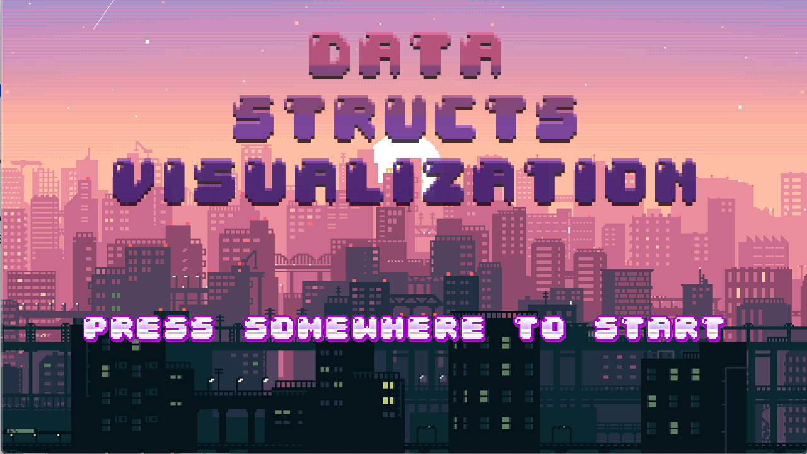
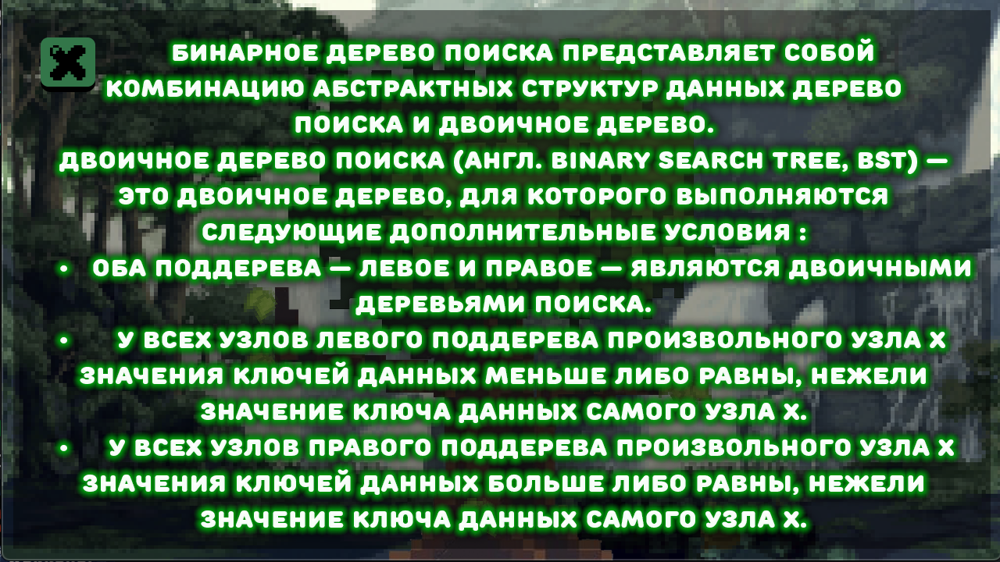

# data-structs-visualizations
Представлены визуализации структур данных:
- Очередь
- Стек
- Дек
- Бинарное дерево поиска

## Главное меню
[visualizer.h](https://github.com/nikitakosatka/data-structs-visualizations/blob/master/dsv/visualizer.h) - основной класс визуализатора, главное меню

## Очередь
[queue.h](https://github.com/nikitakosatka/data-structs-visualizations/blob/master/dsv/queue.h) - класс визуализатора очереди

## Стек
[stack.h](https://github.com/nikitakosatka/data-structs-visualizations/blob/master/dsv/stack.h) - класс визуализатора стека

## Дек
[deque.h](https://github.com/nikitakosatka/data-structs-visualizations/blob/master/dsv/deque.h) - класс визуализатора дека

## Дерево
[tree.h](https://github.com/nikitakosatka/data-structs-visualizations/blob/master/dsv/tree.h) - класс визуализатора дерева

